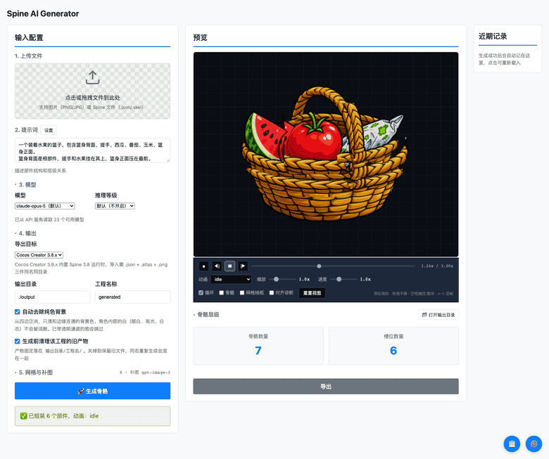
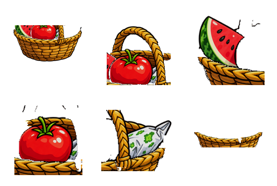

# Spine AI Generator

把一张 2D 立绘**自动拆成部件、生成骨架、导出成 Spine 工程**的本地工具。

上传一张图 → AI 判断有哪些部件、谁压着谁 → 像素级切图 → 生成骨骼层级 → 一键导出
`.json` / `.atlas` / `.png` 三件套，外加一个能直接进 Spine 编辑器二次编辑的 `.spine` 工程。

<p align="center">
  
</p>

<p align="center">
  <sub>看板实录：左栏是输入配置，中间是拼装预览（可切部件/骨骼/网格线框、播放 idle 动画），
  右侧是生成日志和近期记录。录的是真实会话，没有剪辑。</sub>
</p>

<sub>看不了 GIF？[下载 mp4](docs/images/demo.mp4)（750KB，画质更好）。</sub>

---

## 目录

- [这是什么](#这是什么)
- [效果](#效果)
- [技术实现流程](#技术实现流程) ← 输入 → bbox → SAM → 网格 → 骨架 → 导出的完整链路
- [最小可用范围](#最小可用范围) ← 只想要结果的话看这里
- [快速开始](#快速开始)
- [使用流程](#使用流程)
- [导出产物结构](#导出产物结构)
- [技术栈](#技术栈)
- [配置](#配置)
- [常见问题](#常见问题)
- [文档](#文档)
- [开发](#开发)

---

## 这是什么

做 2D 游戏（尤其是带骨骼动画的角色）时，美术把一张立绘手工拆成头、身体、手臂、配饰……再
在 Spine 里建骨骼、绑权重、调绘制顺序，是个重复且耗时的活。这个工具把这段自动化：

| 步骤 | 手工做 | 这个工具 |
|---|---|---|
| 拆部件 | 抠图软件里一块块抠 | AI 判断部件清单 + 像素级分割 |
| 定层级 | 逐个想谁是谁的父级 | 按遮挡关系自动推断 |
| 建骨骼 | 手动摆放、对旋转中心 | 从部件 bbox 和姿态推出 pivot |
| 做网格 | 沿接缝手动连线刷权重 | 栅格剖分 + 环带缝合，接缝共享权重 |
| 补遮挡 | 手工仿制图章补被压住的部分 | 图像生成模型按上下文补图 |
| 导出 | 逐个骨架/图集配置 | 一键出多目标格式 |

**它不是"一键出成品动画"**，它产出的是**一个干净、可继续编辑的工程起点**：部件分好了、
层级建好了、权重刷好了，美术拿到手是接着调网格和 K 帧，而不是从空白开始。

> 质量取决于源图。角色立绘（部件边界清晰、遮挡关系明确）效果最好；
> 部件互相穿插得很碎、或大量半透明的图，需要人工收尾。

---

## 效果

下面这组图是真实的输出，没有任何手工修饰。源图是仓库里的 `test_assets/12.png`：

<table>
<tr>
<td width="33%"></td>
<td width="33%"></td>
<td width="33%"></td>
</tr>
<tr>
<td align="center"><b>① 输入</b><br><sub>一张完整立绘</sub></td>
<td align="center"><b>② 自动分部件</b><br><sub>basket_back / handle / watermelon<br>tomato / corn / basket_front</sub></td>
<td align="center"><b>③ 按 bbox 贴回</b><br><sub>部件 + 位置 + 层级 → 还原成原图</sub></td>
</tr>
</table>

第 ③ 步是关键验证：**切出来的部件能严丝合缝贴回原位**，说明分割的位置和尺寸是对的。
在此基础上把部件改成跟着骨骼走，就是动画——也就是开头那个 GIF 里播放的效果。

<table>
<tr>
<td width="50%"></td>
<td width="50%">
<b>部件是独立且完整的</b>

每个部件都带自己的透明通道，边界之外的像素被清掉。
被前方部件压住的区域由补图模型按上下文补全，所以部件单独看也不会有洞。

<b>层级从遮挡关系推出来</b>

`basket_front` 压着 `tomato`，`tomato` 压着 `basket_back`——
这个先后关系就是 Spine 里的绘制顺序（slot 顺序），也是骨骼父子关系的主要依据。

<b>接缝共享权重</b>

相邻部件的接缝处做成蒙皮网格，两侧顶点带相同的骨骼权重，
转动时被"拉"在一起，而不是硬生生错开露出缝。
</td>
</tr>
</table>

---

## 技术实现流程

从一张 PNG 到一个 Spine 工程，中间经过这些处理阶段：

```
┌─────────────────────────────────────────────────────────────────────────┐
│  ① 输入                                                                   │
│     立绘 PNG（带 alpha）                                                   │
│     ↓ 读出宽高，作为全局坐标系                                             │
└─────────────────────────────────────────────────────────────────────────┘
                                    │
┌───────────────────────────────────▼─────────────────────────────────────┐
│  ② 视觉理解（Claude 视觉模型）                                             │
│     把整图 + 提示词交给模型，要它回答：                                     │
│       · 有哪些部件（名字、语义）                                            │
│       · 每个部件的 bbox（像素框）        ← 粗定位                          │
│       · 每个部件的 pivot（旋转中心）      ← 关节在哪                       │
│       · 每个部件的 parent（父子关系）     ← 从遮挡关系推                    │
│       · 每个部件的 depth（绘制顺序）      ← 谁压着谁                       │
│       · 每个部件的多边形轮廓（可选）       ← 精定位                        │
│     ↓ 得到 parts[] ，一份带层级的部件表                                    │
└─────────────────────────────────────────────────────────────────────────┘
                                    │
                    ┌───────────────┴───────────────┐
                    ▼                               ▼
┌───────────────────────────────┐   ┌───────────────────────────────────────┐
│  ③a 像素级分割（MobileSAM）    │   │  ③b 多边形轮廓（回退路径）             │
│     可选，需额外装 ~800MB      │   │     用 ② 给的多边形做蒙版              │
│     把 bbox 当 prompt 喂给 SAM │   │     不需要任何额外依赖                 │
│     得到每个部件的精确像素掩码  │   │     边界精度略低，但纯 Node 就能跑      │
│       ↓                        │   │       ↓                               │
│   掩码唯一归属：                │   │                                       │
│     重叠像素归 depth 最大者     │   │                                       │
│     （被压住的部件不抢前景）     │   │                                       │
│       ↓                        │   │                                       │
│   掩码夹回自己的框内：          │   │                                       │
│     防止小配件（眼镜）溢出到     │   │                                       │
│     大部件（脸）上把整片擦掉     │   │                                       │
│       ↓                        │   │                                       │
│   无主像素按连通性认领：        │   │                                       │
│     掩码没覆盖但有人画了的地方   │   │                                       │
│     归给面积最小的框（配件优先） │   │                                       │
└───────────────────────────────┘   └───────────────────────────────────────┘
                    │                               │
                    └───────────────┬───────────────┘
                                    ▼
┌─────────────────────────────────────────────────────────────────────────┐
│  ④ 切图（sharp）                                                          │
│     · 按掩码把每个部件抠出来，写 <部件名>.png（带 alpha）                   │
│     · 写 <部件名>.erased.png  —— 被本部件遮挡的真实像素（补图的真值）       │
│     · 写 <部件名>.front.png   —— 本部件在别人前面的部分                     │
│     · 背景移除 + 边缘收干净                                                │
└─────────────────────────────────────────────────────────────────────────┘
                                    │
┌───────────────────────────────────▼─────────────────────────────────────┐
│  ⑤ 遮挡补图（图像生成模型，可选）                                          │
│     被前方部件压住的地方，切图上是透明的洞。要补出来，                       │
│     否则部件一转就露出缺口。                                               │
│       · 输入：待补的部件切图 + 上下文（原图对应区域）                       │
│       · 输出：被压住区域的内容，填回切图                                   │
│       · 补图重影的处理：被盖住的那片直接用 .erased.png 的真值贴回，         │
│         不让模型照着遮挡者再画一遍                                        │
│     ↓ 补完的切图写回 _temp/Image/                                         │
└─────────────────────────────────────────────────────────────────────────┘
                                    │
┌───────────────────────────────────▼─────────────────────────────────────┐
│  ⑥ 底板与孔洞兜底                                                          │
│     · _base_plate：整图尺寸的一层，兜住所有部件拼不上的缝                    │
│     · 补图守卫：近白/近黑的填充视为"补砸了"，替换成邻域真值                  │
└─────────────────────────────────────────────────────────────────────────┘
                                    │
┌───────────────────────────────────▼─────────────────────────────────────┐
│  ⑦ 网格剖分（生成蒙皮网格）                                                │
│     对每个有父级的部件：                                                   │
│       · 栅格剖分 —— 均匀采样出三角网格                                     │
│       · 环带缝合 —— 接缝处两侧共享顶点权重，转动时不离缝                     │
│       · 每个顶点最多 4 条骨骼影响（Spine 上限）                             │
│     根部件保持 region（无权重）即可                                        │
└─────────────────────────────────────────────────────────────────────────┘
                                    │
┌───────────────────────────────────▼─────────────────────────────────────┐
│  ⑧ 骨架生成（generateSkeleton）                                            │
│     · 骨骼：按拓扑序（父在子前），每根骨骼的 x/y 是相对父级的偏移             │
│     · 合成 root：所有顶层部件挂到一根合成 root 下                           │
│       —— Spine 编辑器硬性要求单根骨骼，多一根整份拒绝导入                    │
│     · 槽位 = 绘制顺序：按 depth 排序，不是按骨骼顺序                         │
│     · pivot → 骨骼原点：部件绕自己的 pivot 旋转                             │
│     · 像素坐标 → Spine 坐标：原点居中、Y 轴翻转                             │
└─────────────────────────────────────────────────────────────────────────┘
                                    │
┌───────────────────────────────────▼─────────────────────────────────────┐
│  ⑨ 动画（generateAnimations）                                              │
│     · idle：整体轻微上下浮动（root 的 translate）+ 各部件错相位小幅旋转       │
│       幅度压到 1.5° 以内 —— 拼合式切图一旦转多，接缝会立刻暴露               │
│     · 旋转字段名按版本走：3.8 是 angle，4.0+ 是 value                        │
└─────────────────────────────────────────────────────────────────────────┘
                                    │
┌───────────────────────────────────▼─────────────────────────────────────┐
│  ⑩ 导出（exportToSpine）                                                   │
│     · 骨架 JSON 转规范形状：权重从"平行数组"内联进 vertices 流                │
│     · 图集打包：所有切图打成一张 .png + .atlas                              │
│     · 目标格式适配：Cocos 3.8 / Unity / Spine 4.0-4.2                       │
│     · .spine 工程：调 Spine 编辑器 CLI 生成（私有二进制格式，不能自己拼）      │
└─────────────────────────────────────────────────────────────────────────┘
                                    │
┌───────────────────────────────────▼─────────────────────────────────────┐
│  ⑪ 产物落盘                                                                │
│     见「导出产物结构」，三件套给引擎，.spine 给编辑器，中间产物留在 _temp      │
└─────────────────────────────────────────────────────────────────────────┘
```

### 一句话概括每一步在解决什么

| 阶段 | 解决的问题 | 不做会怎样 |
|---|---|---|
| ② 视觉理解 | 图里有哪些部件、谁压着谁 | 不知道该切成几块 |
| ③ 分割 | 每个部件的精确像素边界 | 切图互相重叠，转动时穿插 |
| ④ 切图 | 把像素真正搬到独立文件 | 无从谈起 |
| ⑤ 补图 | 被压住的区域是空的 | 部件一转就露洞 |
| ⑥ 兜底 | 拼不上的缝、补砸的填充 | 底板黑块/白点 |
| ⑦ 网格 | 接缝两侧怎么分权重 | 接缝裂开 |
| ⑧ 骨架 | 层级、旋转中心、绘制顺序 | 动起来全乱 |
| ⑨ 动画 | 有个默认动作能看 | 空骨架 |
| ⑩ 导出 | 变成引擎能加载的格式 | 进不了项目 |

---

## 最小可用范围

**核心流程只需要 Node + 一个 API Key**，其余全是可选增强：

| 功能 | 需要什么 | 不要它会怎样 |
|---|---|---|
| AI 分析部件 | **必需**：一个视觉模型 API Key | 工具无法工作 |
| 切图 / 拼装 / 骨架 / 导出 | **必需**：Node 20+ | 工具无法工作 |
| 像素级分割 | 可选：MobileSAM（约 800MB） | 回退到多边形蒙版，边界略糙但能用 |
| 遮挡补图 | 可选：一个图像生成模型 | 被压住的区域留透明，部件单独看有洞 |
| `.spine` 源工程 | 可选：本机装了 Spine 4.x 编辑器 | 三件套照常产出，只是没有可二次编辑的工程 |

也就是说：**`npm install` + 填 API Key 就能跑出三件套**。剩下三项按需再装，
任意一项缺失都只影响对应的那一个产出，不会让整条流程失败。

---

## 快速开始

```bash
# 1. 依赖
npm install

# 2. 配置 API（二选一）
cp .env.example .env
#   然后编辑 .env，填 ANTHROPIC_API_KEY
#   用自建网关/中转服务的，再填 ANTHROPIC_BASE_URL
#   也可以不建 .env，直接在网页界面里填

# 3. 启动
npm run web
# → http://localhost:3000
```

无需任何 Python 环境、无需 Spine 编辑器即可产出可用工程。

**可选增强**（按需）：

```bash
# 像素级分割：自动建虚拟环境 + 拉模型权重（约 800MB，一次性）
npm run sam:setup && npm run sam:check

# .spine 源工程：装好 Spine 4.x 编辑器即可，会自动找常见安装位置
# 装在别处就设 SPINE_CLI_PATH
```

---

## 使用流程

| # | 在界面上做什么 | 背后发生什么 |
|---|---|---|
| 1 | 上传立绘 PNG | 读出尺寸，建立像素坐标系 |
| 2 | 输入提示词，描述部件结构与旋转中心 | 提示词质量直接决定部件表质量，[见下](#提示词怎么写) |
| 3 | 选目标格式（Cocos 3.8 / Unity / Spine 4.x） | 决定骨架版本号和 skins 形状 |
| 4 | 点「生成」 | 走上面 ②→⑧ 全流程，日志面板实时输出 |
| 5 | 在预览区看拼装结果、切播放看 idle 动画 | 有缝/有异色就能立刻发现 |
| 6 | 点「导出」 | 走 ⑩→⑪，产出三件套 + `.spine` |

### 提示词怎么写

工具自带四类提示词模板（角色 / 道具 / 特效 / 物品），在界面上点「2. 提示词」旁的
**设置**按钮可以改，模板存在 `config/prompt-templates.json`。

写提示词的关键是**描述结构和旋转中心**，而不是描述画面内容：

```
✅ 好的写法
   一个女角色，左手叉腰、右手拿剪刀。
   包含：头、发髻、眼镜、身体、围裙、左臂、右臂（含剪刀）、鞋。
   头部绕脖子旋转；手臂绕肩膀旋转；围裙绕腰部旋转。
   绘制顺序：身体 → 围裙 → 手臂 → 头 → 发髻 → 眼镜。

❌ 差的写法
   一个生气的女人
   （没说有哪些部件、没说层级、没说旋转中心）
```

---

## 导出产物结构

```
output/<工程名>/
│
├── <输入图名>_temp/                    ← 中间产物，重跑补图要用，导出不会清掉
│   └── Image/
│       ├── <部件>.png                  切图
│       ├── <部件>.erased.png           被遮挡区域的真实像素（补图真值）
│       ├── <部件>.front.png            该部件在别人前面的部分
│       └── verify-input.json           校验用输入快照
│
└── <输入图名>/
    ├── Spine工程/
    │   └── <输入图名>.spine            ← 可直接用 Spine 编辑器打开，二次编辑用
    │
    └── <目标格式>/                      cocos-3.8 / unity / spine-4.2 ...
        └── <输入图名>/
            ├── <输入图名>.json         骨架
            ├── <输入图名>.atlas        图集描述
            ├── <输入图名>.png          图集页
            ├── images/                 散图（回编辑器改网格时用）
            └── README.txt              这次导出的参数与结果摘要
```

**为什么中间产物单独放 `_temp/`**：补图重跑、重新切图都要读它，导出时清掉就得重跑一遍
昂贵的 AI 流程。每个导出目标各占一层目录，是因为 3.8 和 4.x 的骨架/图集格式互不兼容，
平铺会互相覆盖——重导 Cocos 时 Unity 那份原封不动。

---

## 技术栈

| 层 | 用了什么 | 为什么 |
|---|---|---|
| 运行时 | **Node.js 20+**（ESM） | 全程无构建步骤，改完直接跑 |
| Web 服务 | **Express** + SSE | SSE 推日志流，流水线进度实时可见 |
| 图像处理 | **sharp** | 原生 libvips，切图/拼装/合成都是毫秒级 |
| 视觉理解 | **Claude 视觉模型** | 要它输出结构化 JSON（部件表），不只是描述画面 |
| 遮挡补图 | **图像生成模型**（可选） | 补被压住的区域 |
| 像素级分割 | **MobileSAM**（可选，Python） | bbox 当 prompt 出精确掩码 |
| 编辑器交互 | **Spine CLI**（可选） | `.spine` 是私有二进制格式，只能由官方 CLI 生成 |
| 浏览器测试 | **Playwright**（dev） | 界面回归测试 |
| 前端 | 原生 JS，无框架 | 单页面工具，上框架是负担 |

### 设计上的几个取舍

**为什么不用 SAM 硬撑着，而是留一条多边形回退路径**：SAM 要装 800MB 的 Python 环境，
很多人只想先看看效果。回退路径用 AI 直接给的多边形，精度差一点但零依赖，
让人在决定要不要装之前就能跑通全流程。

**为什么 `.spine` 不自己生成**：它是 Spine 私有的二进制工程格式（raw-deflate 包裹标记流），
没有公开规范，各 4.x 小版本之间都会变。照着反推写一份，编辑器升级就静默读坏——
比不产出更糟。所以走官方支持的 CLI。

**为什么用 SSE 而不是 WebSocket**：日志是单向的，SSE 够用且自带重连，少一层握手。

---

## 配置

所有配置项在 `.env`（参考 `.env.example`，已 gitignore）。

| 变量 | 默认 | 说明 |
|---|---|---|
| `ANTHROPIC_API_KEY` | 空 | API Key，必填（也可在界面里填） |
| `ANTHROPIC_BASE_URL` | 空 | 留空直连 Anthropic 官方；用自建网关/中转服务就填它的地址 |
| `PORT` | `3000` | 监听端口 |
| `OUTPUT_DIR` | `./output` | 产物根目录 |
| `SPINE_CLI_PATH` | 自动查找 | Spine 编辑器可执行文件 |
| `SPINE_SAM_HOME` | `~/.spine-tool/mobilesam` | MobileSAM 环境位置 |

**换 API 接入点**：改 `config/api-defaults.json` 一处即可——界面表单的默认值从那里取，
不用在代码里翻找。`.env` 里的设置优先级更高，只影响本机。

---

## 常见问题

**Q: 需要联网吗？**
分析、补图、分割都要调模型，需要联网。切图、拼装、骨架生成、导出全在本地。

**Q: 不装 MobileSAM 能用吗？**
能。会自动回退到多边形蒙版，边界精度低一些，但流程完整。想对比效果可以先不装跑一遍。

**Q: 生成的部件被切坏了 / 有黑块白点怎么办？**
先看日志面板里有没有补图失败的记录；「重跑补图」按钮可以只重跑失败的那些。
补图守卫会把近白、近黑、中暗色的填充判定为补砸并替换成邻域真值。

**Q: 生成的骨架缺件 / 层级不对？**
绝大多数是提示词的问题——回到第 2 步把部件清单、层级、旋转中心写清楚再生成。
也可以直接在界面上改提示词模板。

**Q: 能在 Spine 里直接打开导出结果吗？**
`.json` 是**导入**进 Spine（新建工程再导入），`.spine` 才是**打开**。
两者都在导出目录里，`.spine` 在 `Spine工程/` 下。

**Q: 支持哪些输入格式？**
PNG / JPG / WebP。要透明背景的话建议用 PNG。

**Q: 为什么会生成 `_base_plate` 这个部件？**
它是整图大小的兜底层，用来遮住部件之间拼不上的细缝。如果不需要，可以在提示词里
要求不要底板，或生成后手动删掉。

---

## 文档

| 文档 | 内容 |
|---|---|
| [Web 服务用法](docs/guides/web-service.md) | 界面各步骤详解、提示词技巧、环境变量 |
| [背景移除与补图](docs/guides/background-removal.md) | 补图流程的完整技术细节与踩坑记录 |
| [基于深度的擦除](docs/notes/depth-based-erasure.md) | 部件隔离为什么按 depth 决定归属 |
| [MobileSAM 可行性验证](docs/notes/mobilesam-feasibility.md) | 为什么选 MobileSAM、实测数据、提示策略对比 |

`docs/notes/` 下是**排查记录**，记录某个问题当时是怎么查、怎么量的。想知道某个设计
决定为什么这么定，通常能在那里找到当时的实测数据。

---

## 开发

```bash
npm install              # 装依赖

npm run web              # 启动服务
npm test                 # 单元测试
npm run test:e2e         # 端到端（真跑 AI，慢）
npm run test:shot        # 界面截图回归
npm run verify           # 校验产物结构
npm run shot             # 截预览图
npm run check            # 环境自检
npm run sam:check        # MobileSAM 环境状态
```

### 代码结构

```
server/
├── index.js              HTTP 路由 + SSE 日志流
├── generate-cli.js       命令行入口
├── ai/
│   ├── claude.js         视觉理解：图 → 部件表
│   ├── models.js         模型清单
│   ├── image-models.js   图像生成模型清单
│   └── api-defaults.js   接入点默认值（读 config/api-defaults.json）
├── api/
│   ├── cutter.js         切图：掩码 → 独立 PNG
│   ├── isolate.js        部件隔离：重叠归属、无主像素认领
│   ├── mesh.js           栅格剖分 + 环带缝合
│   ├── generator.js      骨架与动画生成
│   ├── targets.js        目标格式适配（3.8 / 4.x 形状差异）
│   ├── atlas.js          图集打包
│   ├── spine-project.js  Spine CLI 交互，生成 .spine
│   ├── inpaint.js        遮挡补图
│   ├── background.js     背景移除
│   ├── baseplate.js      底板兜底
│   ├── workspace.js      目录结构（唯一一份落点算法）
│   └── env-file.js       .env 读写
└── sam/                  MobileSAM 集成（可选）
    ├── client.mjs        常驻进程客户端
    ├── worker.py         Python worker
    └── setup.mjs         一键装环境

web/                      前端（原生 JS，无框架）
src/                      独立的 Spine 读写库（JSON/Binary 解析、往返、校验）
scripts/                  工具脚本
docs/                     文档与配图
config/                   prompt-templates.json、api-defaults.json
temp/test/                测试
```

### 跑测试

```bash
npm test                 # 快，不碰网络
npm run test:e2e         # 慢，真调 API，验证完整链路
```

`src/` 下的 Spine 读写库可以独立使用——它不依赖 server，做骨架格式转换很方便。

---

## License

MIT
